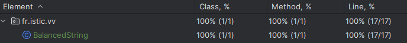
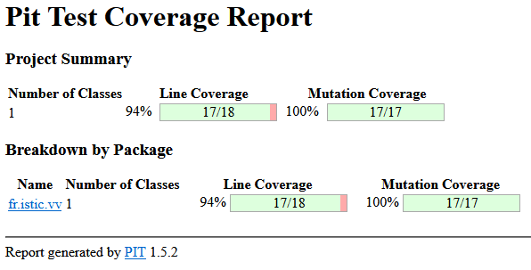

# Balanced strings

A string containing grouping symbols `{}[]()` is said to be balanced if every open symbol `{[(` has a matching closed symbol `)]}` and the substrings before, after and between each pair of symbols is also balanced. The empty string is considered as balanced.

For example: `{[][]}({})` is balanced, while `][`, `([)]`, `{`, `{(}{}` are not.

Implement the following method:

```java
public static boolean isBalanced(String str) {
    ...
}
```

`isBalanced` returns `true` if `str` is balanced according to the rules explained above. Otherwise, it returns `false`.

Use the coverage criteria studied in classes as follows:

1. Use input space partitioning to design an initial set of inputs. Explain below the characteristics and partition blocks you identified.
2. Evaluate the statement coverage of the test cases designed in the previous step. If needed, add new test cases to increase the coverage. Describe below what you did in this step.
3. If you have in your code any predicate that uses more than two boolean operators, check if the test cases written so far satisfy *Base Choice Coverage*. If needed, add new test cases. Describe below how you evaluated the logic coverage and the new test cases you added.
4. Use PIT to evaluate the test suite you have so far. Describe below the mutation score and the live mutants. Add new test cases or refactor the existing ones to achieve a high mutation score.

Write below the actions you took on each step and the results you obtained.
Use the project in [tp3-balanced-strings](../code/tp3-balanced-strings) to complete this exercise.

## Answer

1. 

- **) ] ou } en premiere position dans la chaîne** : retourne false
- **( [ ou { en dernière position dans la chaîne** : retourne false
- **chaîne vide** : retourne vrai
- **seulement du texte** : retourne vrai
- **([{}])** : retourne vrai
- **"f(d[{e}])abc" les symboles correctement utilisés + du texte** : retourne vrai

2. Voici la couverture des tests que nous avons décrit précédement.
  
Pour ce faire, nous avons écrit nos tests avec Junit puis utilisé **Run 'la classe de test' with Coverage**

3. Nous avons une seule ligne qui possède deux opérateurs booléens qui est la suivante : if (c == '(' || c == '[' || c == '[')
Avec les tests que nous avons, nous couvrons déjà cette ligne de code.
            

## Voici le code que nous avons écrit pour cet exercice :

```Java
public static boolean isBalanced(String str) {
        Stack<Character> stack = new Stack();
        for (char c : str.toCharArray()) {
            if (c == '(' || c == '[' || c == '{') {
                stack.add(c);
            } else if (c == ')') {
                if (stack.isEmpty() || stack.lastElement() != '(') {
                    return false;
                }
                stack.pop();
            } else if (c == ']') {
                if (stack.isEmpty() || stack.lastElement() != '[') {
                    return false;
                }
                stack.pop();
            } else if (c == '}') {
                if (stack.isEmpty() || stack.lastElement() != '{') {
                    return false;
                }
                stack.pop();
            }
        }
        return stack.isEmpty();
    }
```

```Java
public class BalancedStringTest {

    @Test
    public void test1() {
        assertFalse(BalancedString.isBalanced(")zneznf"));
    }

    @Test
    public void test2() {
        assertFalse(BalancedString.isBalanced("]zneznf"));
    }

    @Test
    public void test3() {
        assertFalse(BalancedString.isBalanced("}zneznf"));
    }

    @Test
    public void test4() {
        assertFalse(BalancedString.isBalanced("zneznf("));
    }

    @Test
    public void test5() {
        assertFalse(BalancedString.isBalanced("zneznf["));
    }

    @Test
    public void test6() {
        assertFalse(BalancedString.isBalanced("zneznf{"));
    }

    @Test
    public void test7() {
        assertTrue(BalancedString.isBalanced(""));
    }

    @Test
    public void test8() {
        assertTrue(BalancedString.isBalanced("reherheheht"));
    }

    @Test
    public void test9() {
        assertTrue(BalancedString.isBalanced("([{}])"));
    }

    @Test
    public void test10() {
        assertTrue(BalancedString.isBalanced("ezfze(ezfez[{efz}sdf]sdg)"));
    }

}
```

4. 
